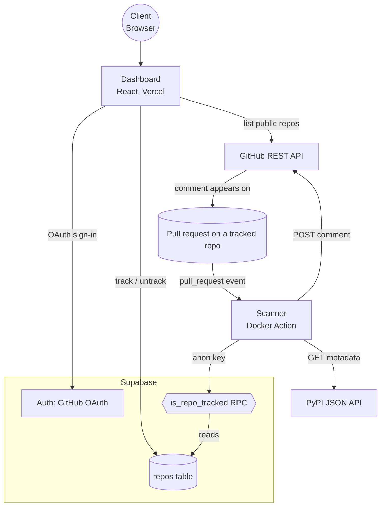

# deprecation-auditor

**Note:** Audits Python (PyPI) dependencies only.

Access at the [Vercel app](https://deprecation-auditor.vercel.app/), follow instructions on the app to add the GitHub Action to a repo. The repo picker only lists public repos.

Make sure the targeted repo has tracking enabled and has the the workflow YAML in the specified path. If `requirements.txt` isn't at the repo root, update the `manifest-path` line in the pasted YAML to point at its actual location.

For each tracked repo, the `deprecation-auditor` creates a comment for each pull request (including initial PR and subsequent pushes to that PR) detailing:

* the existence of deprecated/yanked Python dependencies.
* the reason, if provided, for the deprecation
* the lines of code where the bad dependency is used, as well as the full code on that line

Example of comment can be found on the [dogfood branch of this repo](https://github.com/dxfeng/deprecation-auditor/pull/1)

Yanked status is taken from `pypi` API, while fully deprecated Python dependencies are checked from an in-repo database.

To-do:
- Work on packages.json (npm/js)
- Increase size of deprecated dependency repo
- Make audit results visible on the Vercel `dashboard`

**Architecture**

`dashboard/` Written in React. Deployed on Vercel. Allows GitHub sign-in and enable tracking/un-tracking of repos.
`scanner/` A Docker Action (since I needed various specific python dependencies and wanted more control over env). Queries Pypi API and uses the in-repo dataset to check what dependencies of the given repo are deprecated/yanked. Uses `ast` library to find the exact lines bad dependencies are used.

*supabase* - PostgreSQL database to store what repos are tracked by a user. Currently has blank tables regarding the detections found.